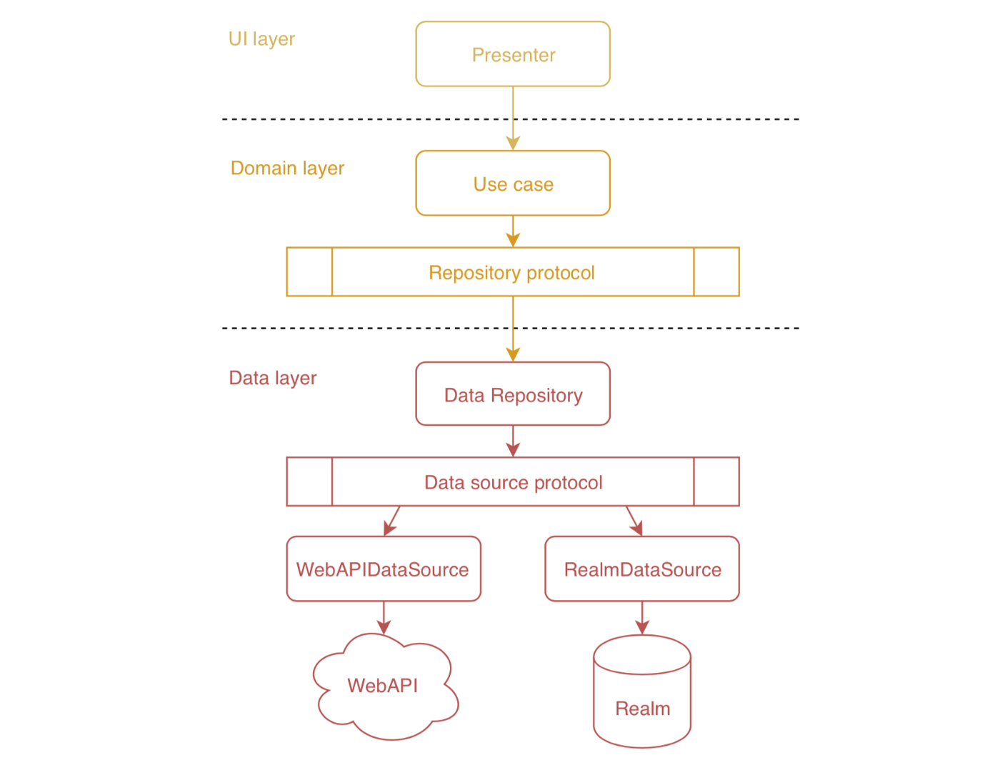
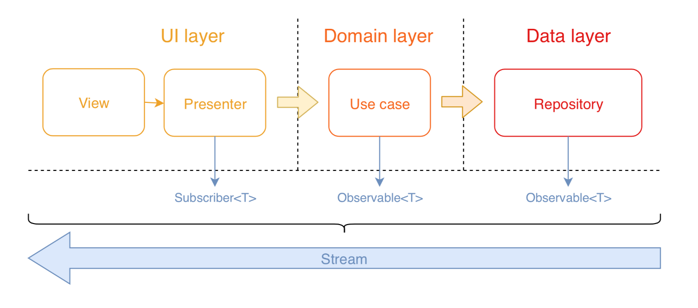

# Clean Architecture

> Clean architecture is the structure of layers for organizing our app so that it's easy to understand and easy to change as it grows.

- [VIPER](#viper)
  * [View](#view)
  * [Interactor](#interactor)
  * [Presenter](#presenter)
  * [Entity](#entity)
    - [Repository](#repository)
  * [Router / Wireframe](#router-/-wireframe)
  * [Assembly](#assembly)
    - [Dependency Injection](#dependency-injection)
  * [DataManager](#datamanager)
- [RxSwift](#rxswift)
  * [Stream](#stream)
  * [Sequence](#sequence)
  * [Observable](#observable)
    - [Observable Life Cycle](#observable-life-cycle)
    - [Creating Observable](#creating-observable)
  * [Observer](#observer)
  * [Subscription](#subscription)
  * [Subject](#subject)
    - [Publish Subject](#publish-subject)
    - [Behaviour Subject](#behaviour-subject)
    - [Replay Subject](#replay-subject)
  * [Dispose bag](#dispose-bag)
- [Communication between layers](#communication-between-layers)
- [State management](#state-management)
- [Design patterns](#design-patterns)
  * [Singleton](#singleton)
  * [Factory](#factory)
  * [Abstract Factory](#abstract-factory)
  * [Builder](#builder)
  * [Iterator](#iterator)
  * [Observer](#observer)
  * [Repository](#repository)
- [References](#references)

---

## VIPER

**V**iew, **I**nteractor, **P**resenter, **E**ntity, **R**outer

**VIPER** is an implementation of **Clean Architecture** oriented to iOS apps, based on the **Single responsibility principle** of **SOLID** software design principles.

By applying VIPER, we separate the files or classes into components that can change independently of other components. Each block corresponds to an object with specific tasks, inputs, and outputs.


### View

This is the **UI** layer, the most external. It draws the orders sent by the **Presenter** and also asks it what to do in response to user inputs.

`Modules/Settings/Views/SettingsViewController.swift`

```swift
class SettingsViewController: UIViewController {
    private let presenter: SettingsPresenter
    private let bag: DisposeBag = DisposeBag()

    @IBOutlet weak var tableView: UITableView!

    init(presenter: SettingsPresenter) {
        self.presenter = presenter
        
        super.init(nibName: String.init(describing: type(of: self)), bundle: Bundle.init(for: type(of: self)))
    }

    required init?(coder aDecoder: NSCoder) {
        fatalError("init(coder:) has not been implemented")
    }

    override func viewDidLoad() {
        super.viewDidLoad()

        tableView.dataSource = presenter.dataManager
        tableView.delegate = presenter.dataManager 
    }

    func userWantsToShowAnotherViewController() {
        presenter.userWantsToShowAnotherViewController(navigationController)
    }
}
```

### Interactor

This layer contains the business logic of the **use cases**. Here we manipulate **Entities** (models) to carry out a specific task, using the **Repository** pattern to encapsulate **network calls** and **DB queries**.

`Modules/Settings/Interactors/SettingsInteractor.swift`

```swift
class SettingsInteractor {
    private let repository: Repository
    private let settingsModel: Settings
    private let bag = DisposeBag()
    
    let dataManager: SettingsDataManager
    
    init(repository: Repository) {
        self.repository = repository
        self.settingsModel = Settings()
        self.dataManager = SettingsDataManager(data: settingsModel)
    }

    func requestMySetting() {
        repository.requestMySetting().subscribe(onSuccess: { [weak self] mySetting in
            // handle mySetting
        }).disposed(by: bag)
    }
}
```

### Presenter

This layer tells the **View** what to present once it receives the information from the **Interactor** and it reacts to the actions of the **View** in order to ask for data or navigation.

`Modules/Settings/Presenters/SettingsPresenter.swift`

```swift
class SettingsPresenter {
    private let interactor: SettingsInteractor
    private let wireframe: SettingsWireframe
    
    var dataManager: SettingsDataManager {
        return interactor.dataManager
    }
    
    init(interactor: SettingsInteractor, wireframe: SettingsWireframe) {
        self.interactor = interactor
        self.wireframe = wireframe
    }

    func userWantsToShowAnotherViewController(context: UINavigationController) {
        wireframe.showAnotherViewController(context)
    }
}
```

### Entity

This layer contains the **models** used by the **Interactor**.

- `Models/Repository/`
- `Models/Domain/`
- `Models/Realm/`

#### Repository

**Repository** is a **design pattern** that provides an abstraction of data. It allows us to abstract the domain layer from the data layer and also, inside data layer, the data repository from its data sources.



Since we need to query the model objects from different locations in the code over and over again, a repository provides a single-entry point to work with the models and remove duplicate query code.

`Models/Repository/Repository.swift`

```swift
class Repository {
    static let sharedInstance = Repository()

    init() {
      // Setup Realm DB
    }
}
```

`Models/Repository/Repository+Settings.swift`

```swift
extension Repository {

    func fetchMySetting(identifier: Int) -> MySetting? {
        return try! Realm().objects(MySetting.self).filter(NSPredicate(format: "id = %d", identifier)).first
    }

    func requestMySetting() -> Single<MySetting> {
        let endpoint = MySettingEndpoint()
        return NetworkClient.sharedInstance.rx_request(endpoint).flatMap(saveMySetting)
    }

    private func saveMySetting(_ mySetting: MySetting) -> Single<MySetting> {
        return Single.create { single in
            let realm = try Realm()
            try realm.write {
                realm.add(mySetting, update: .modified)
            }
            return Disposables.create()
        }
    }
}
```

### Router / Wireframe

This layer is responsible for handling all the **navigation** between scenes.

`Modules/Settings/Wireframes/SettingsWireframe.swift`

```swift
class SettingsWireframe {
    private let assembly = SettingsAssembly()
    private let anotherAssembly = AnotherAssembly()

    func mainViewController() -> UIViewController {
        return assembly.viewSettingsModuleWithWireframe(self)
    }

    func showAnotherViewController(context: UINavigationController) {
        let vc = anotherAssembly.viewAnotherWithWireframe(AnotherWireframe())
        context.pushViewController(vc, animated: true)
    }
}
```

### Assembly

This layer is responsible for creating and setting up modules.

It **builds** the module and **injects** its dependencies in the constructor.

`Modules/Settings/Assembly/SettingsAssembly.swift`

```swift
class SettingsAssembly {
    private let repository = Repository.sharedInstance
    
    func viewSettingsModuleWithWireframe(_ wireframe: SettingsWireframe) -> UIViewController {
        let interactor = SettingsInteractor(repository: repository)
        let presenter = SettingsPresenter(interactor: interactor, wireframe: wireframe)
        let vc = SettingsViewController(presenter: presenter)
        
        return vc
    }
}
```

#### Dependency Injection

**Dependency Injection (DI)** is a technique to apply the **Dependency inversion principle** of **SOLID** software design principles: 

Abstractions should not depend on details. Details should depend on abstractions.

**DI** means giving an object its instance variables.

Although there are DI libraries, we manually inject dependencies in the constructor when we build each module.

### DataManager

This layer encapsulates the **DataSource** and **Delegate** of the components that compose de UI.

`Modules/Settings/DataManagers/SettingsDataManager.swift`

```swift
class SettingsDataManager: UITableViewDataSource, UITableViewDelegate {
    var data: Settings

    init(data: Settings) {
        self.data = data
    }

    func numberOfSections(in tableView: UITableView) -> Int {
        return data.sections.count
    }

    func tableView(_ tableView: UITableView, didSelectRowAt indexPath: IndexPath) {
        tableView.deselectRow(at: indexPath, animated: true)
    }
}
```

`Models/Domain/Settings.swift`

```swift
struct Settings {
    var sections: [SettingsSection]
}

struct SettingsSection {
    var items: [SettingsItem]
    
    init(items: [SettingsItem]) {
        self.items = items
    }
}

struct SettingsItem {
    var title: String
    var subtitle: String?
    
    init(title: String, subtitle: String? = nil) {
        self.title = title
        self.subtitle = subtitle
    }
}

```

## RxSwift

**ReactiveX** for Swift.

ReactiveX, also known as **R**eactive E**x**tensions or RX, is a library for composing **asynchronous** and event-based programs by using **observable sequences**.

**Declarative programming** is a programming paradigm -**style**- that consists of instructing the app on **what** needs to be done, instead of telling it how to do it.

**Reactive programming** is a declarative programming paradigm concerned with data streams and the propagation of change. Using reactive programming your app can react to changes in the underlying data without you telling it to do so. This makes it easier to focus on the logic rather than maintaining a particular **state**.

### Stream

A **stream** is a sequence of ongoing events ordered in time, that may or may not end.

### Sequence

A **sequence** is a list of values that you can step through one at a time. We can use it to create custom collection types.

### Observable

Every Observable sequence is just a sequence. The key advantage for an Observable vs Swift's Sequence is that it can also receive elements **asynchronously**. This is the kernel of *RxSwift*.

#### Observable Life Cycle

- **.next** → An event that carries the latest data value.
- **.completed** → This event terminates the event sequence with success. It won’t emit additional events after complete.
- **.error** → The Observable terminates with an error and will not emit additional events.
- **.dispose** → This event explicitly cancels a subscription, so the observable will stop emitting events.
    - The *.completed* and *.error* will **automatically** call this method.

#### Creating Observable

A **hot** Observable may begin emitting items as soon as it is created. A **cold** Observable waits until an observer subscribes to it before it begins to emit items.

- **just** → Create an observable sequence containing just a single element.
- **deferred** → do not create the Observable until the observer subscribes, and create a fresh Observable for each subscription.
- **of** → Convert any swift type to its corresponding Observable sequence.
- **from** → Creates an observable of individual elements from an array of typed elements.
    - The *from* operator only takes an array.
- **create** → Most flexible operator to create an Observable. You can make any library function reactive using create operator.
    - In this case, since we are creating custom Rx observable, we need to free up the memory by calling **.dispose** manually.
    - There is a **dispose bag** feature in *RxSwift*.

### Observer

An observer can subscribe to observable sequences to receive asynchronous notifications as new data arrive to perform some operation.

Observer bind with observable through **subscription**.

### Subscription

- **.subscribe** → Start observing an observable.

### Subject

A **Subject** acts as both an Observable and Observer. You will be using Subject in most cases in your app.

Since it is an observer, it can subscribe to one or more Observables and also is an Observer, and hence, it can pass through the items it observes by re-emitting them.

It can also emit new items instead of acting as a middle.

#### Publish Subject

A **PublishSubject** starts empty and only emits new elements to its subscribers.

#### Behaviour Subject

A **BehaviourSubject** will **replay** the latest **.next** event to new subscribers and it must start with some initial value.

The concept of emitting previous next events to new subscribers is called replaying.

#### Replay Subject

A **ReplaySubject** replays more than the most recent element on a sequence to new subscribers.

### Dispose bag

The disposable returned by the Subscribe extension methods is returned solely to allow you to manually unsubscribe from the observable before the observable naturally ends. If the observable completes — with either OnCompleted or OnError — then the subscription is already disposed for you.

**DisposeBag** is collection of disposables. When you subscribe to any observables you add disposables to this bag. When the disposeBag is deallocated, its deinit function calls dispose on all of the disposables it contains.

- Don’t create a dispose bag in one class, and share it with another class.
- You should always add your subscriptions to a DisposeBag, even if you know your sequences will surely terminate.
- Official suggestion is to always use **.disposed(by: disposeBag)** even though that's not necessary for simple bindings.

## Communication between layers



Presenter executes a use case that returns an Observable. This Observable is created on data layer and passed by domain layer. Presenter subscribes to this Observable to fetch the result from the repository.

## State management

State is all the stored information, at a given instant in time, to which the program has access. A program is described as stateful if it is designed to remember preceding events or user interactions; the remembered information is called the state of the system.

So, we can say that the state is the sum of all variables in our app's memory.

A **state machine** is an abstract machine that can be in exactly one of a finite number of states at any given time. The state machine can change from one state to another in response to some external inputs. The change from one state to another is called a **transition**. An state machine is defined by a list of its states, its initial state, and the conditions for each transition.

So, we can say that an app is a state machine!

## Design patterns

Design patterns are reusable solutions to common problems in software design.

They help you create loosely coupled code so that you can change or replace components in your code easily and with confidence.

### Singleton

**Singleton** is a **creational design pattern** that ensures that only one instance exists for a given class and that there’s a global access point to that instance.

It usually uses lazy loading to create the single instance when it’s needed the first time..

### Factory

**Factory** is a **creational design pattern** that encapsulates the object creation process and users can simply pass in parameters to a generic factory class without knowing how the objects are actually being created. It allows subclasses to alter the type of objects that will be created.

### Abstract Factory

**Abstract Factory** is a **creational design pattern** that lets you produce families of related objects without specifying their concrete classes.

### Builder

**Builder** is a **creational design pattern** that lets you construct complex objects step by step. The pattern allows you to produce different types and representations of an object using the same construction code.

*Abstract Factory* returns the product immediately, whereas *Builder* lets you run some additional construction steps before fetching the product.

### Iterator

**Iterator** is a **behavioral design pattern** that allows sequential traversal through a complex data structure without exposing its internal details.

### Observer

**Observer** is a **behavioral design pattern** where one object notifies other objects of any state changes.

### Repository

**Repository** is an **structural design pattern** that provides an abstraction of data, so that your application can work with a simple abstraction that has an interface. Using this pattern keeps domain objects persistence ignorant.

## References

- [Introducing VIPER with Reducer and State](https://medium.com/blockchain-engineering/introducing-viper-with-reducer-and-state-158d952a0b36)
- [Repository pattern in Swift](https://medium.com/tiendeo-tech/ios-repository-pattern-in-swift-85a8c62bf436)
