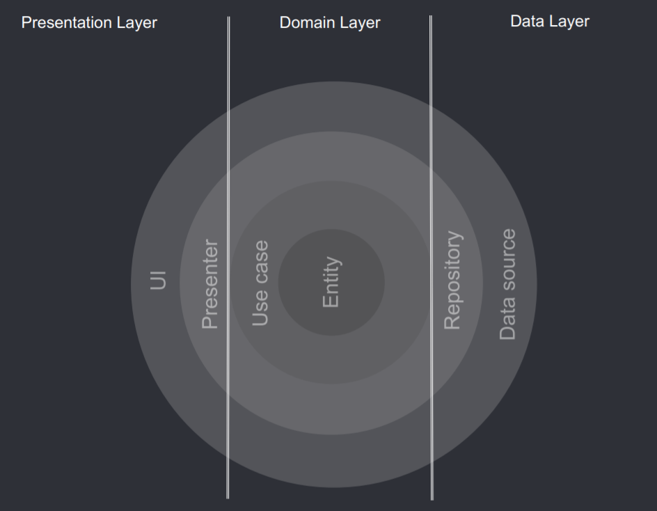

# The Clean Architecture

**Robert C. Martin (Uncle Bob)** introduced the Clean Architecture in 2012.

**Clean Architecture** is the structure of layers for organizing our app so that it's easy to understand and easy to change as it grows.

It extends the essential pattern of three layers, integrating several popular architectures into a single actionable idea.

## Layers

The Clean Architecture has four layers:

- **Domain Layer** - The core business logic of the application.
- **Application Layer** - The entry point for the application.
- **Presentation Layer** - The user interface of the application.
- **Infrastructure Layer** - The external interfaces of the application.

## Dependency

The Clean Architecture's dependency rules are:

- The **Domain Layer** should not depend on **Infrastructure Layer** or **Presentation Layer**.
- The **Application Layer** should depend on **Infrastructure Layer** and **Presentation Layer**.
- The **Infrastructure Layer** should depend on **Presentation Layer**.
- The **Presentation Layer** should not depend on any other layer.

# References

- [Robert C. Martin (Uncle Bob) - The Clean Architecture](https://blog.cleancoder.com/uncle-bob/2012/08/13/the-clean-architecture.html)
