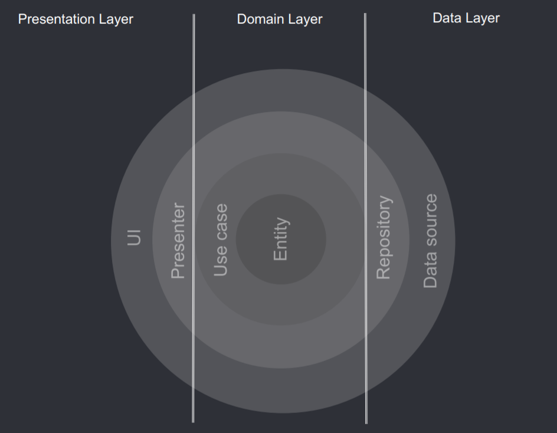

# Data propagation

* [Data Flow](#data-flow)
* [Dependency Rule](#dependency-rule)
  - [Presentation Layer](#presentation-layer)
  - [Domain Layer](#domain-layer)
    * [Repository Interface](#repository-interface)
  - [Data Layer](#data-layer)
    * [Repository Implementation](#repository-implementation)

---

## Data Flow

The data flow is the **communication** between **layers**.

1. UI (ViewController) calls method from Presenter.
2. Presenter executes a use case (interactor) that returns an Observable.
3. This Observable is created on data layer and passed by domain layer.
4. Presenter subscribes to this Observable to fetch the result from the repository.
    - Use case (interactor) combines data from Repositories.
    - Each Repository returns data from a Data Source (Local or Remote).
5. Information flows back to the UI.

We can see how the user action flows from the UI all the way up to the Data Source and then flows back down. This Data Flow is not the same flow as the Dependency Rule.

## Dependency Rule

The dependency rule is the **relationship** between **layers**.

Remember that each layer has its own entities & mappers and that in order to keep our Domain Layer with no dependencies, Data and Presentation are responsible to map to/from Domain Entities depending if you are pushing or pulling data.

### Presentation Layer

Contains UI (*ViewControllers*) that are coordinated by *Presenters* which execute 1 or multiple Use cases (*Interactor*). Presentation Layer **depends on Domain Layer**.

This layer only needs to execute use cases and display data.

### Domain Layer

Is the most INNER part of the onion (**no dependencies with other layers**) and it contains *Entities*, Use cases (*Interactor*) and *Repository Interfaces*.

Domain (with **business rules**) is the most important Layer. Domain Layer does NOT depend on Data Layer.

#### Repository Interface

Use cases (interactor) combine data from 1 or multiple *Repository Interfaces*. Interactor is not using the actual implementation of the Repository that sits in the Data Layer. Instead, it is just using an abstraction/interface in the Domain Layer that acts as a contract for any repository who wants to provide the data.

### Data Layer

Contains *Repository Implementations* and 1 or multiple *Data Sources*. Repositories are responsible to coordinate data from the different Data Sources. Data Layer **depends on Domain Layer**.

#### Repository Implementation

The Repository Implementation implements the Domain Repository Interface and is in charge of combining 1 or multiple Data Sources. The most common ones are Memory, Cache & Remote. This Repository is pulling from the cache and remote interfaces (each Data Source then binds to an implementation). This decoupling makes the Repository agnostic from its Data Sources, avoiding changes when switching a Data Source implementation.

Repositories expect from Data Sources the Domain Models already so it pushes the responsibility of mapping from Data to Domain to each individual Data Source implementation (or from Domain to Data in case you are pushing something to the Data Source).

In order to have a SSOT (**single source of truth**) we can follow a data strategy so that we only return Cache (unique source of truth) and to refresh Cache from Remote only when it is empty or there is a user action (swipe to refresh).
