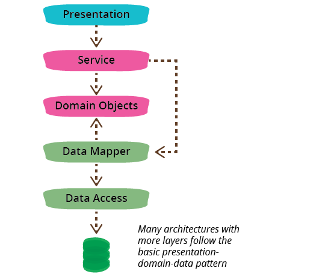

# Three-layer architecture

* [Presentation](#presentation)
* [Domain](#domain)
* [Data](#data)

---

One of the most common ways to structure an app is using 3-layer architecture so that we separate it into three broad layers -presentation (UI), domain logic (aka business logic), and data access-.

## Presentation

This is the topmost level of the application. The presentation layer is a layer which users can access directly (such as a **GUI**).

## Domain

The domain layer controls an application's functionality (also known as **business logic**) by performing detailed processing.

## Data

The data layer includes the data **persistence** mechanisms (database, file system, etc.) and the data **access** layer that encapsulates the persistence mechanisms and exposes the data.

# Dependency

The dependencies generally run from top to bottom through the layer stack: presentation depends on the domain, which then depends on the data source.

A common variation is to arrange things so that the domain does not depend on its data sources by introducing a **mapper** between the domain and data source layers. This approach is often referred to as a **Hexagonal Architecture**.

# Modules

I think of presentation-domain-data as a composite of **presentation-domain** and **domain-data**.

I consider these layers to be a form of module, which is a generic word I use for how we clump our software into relatively independent pieces.

Each of these top-level modules must be **full-stack**, i.e. it contains all the layers.

# References

- [Martin Fowler - Presentation, Domain, Data layering](https://martinfowler.com/bliki/PresentationDomainDataLayering.html)
